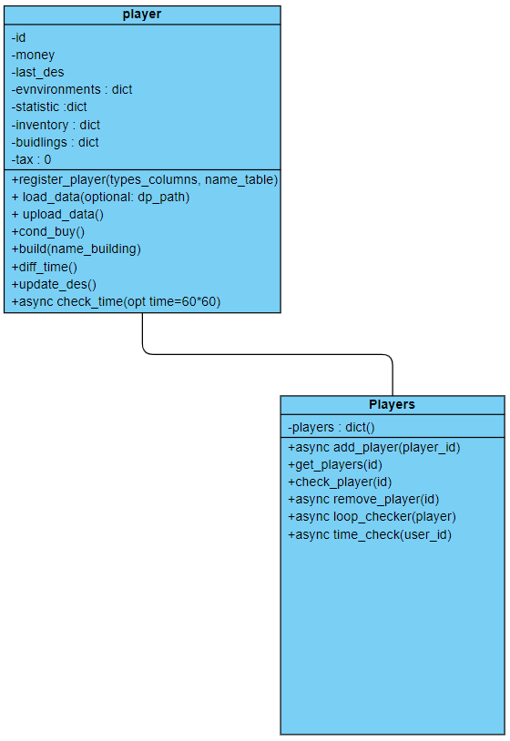

# TG_BOT

### Бот, написанный как копия бота из вк, первоисточник: https://vk.com/bot_lesya 
Это мой первый проект по написаю асинхронного бота-игры в телеграм.

## Описание

Это телеграм-бот, использующий библиотеку **aiogram** для управления игроками и взаимодействия с базой данных. Основные функции включают добавление зданий и предметов через админ-панель, перерасчет статистики игроков, а также различные действия с игровыми данными.

## Основные компоненты

- **Запуск**: Основной скрипт для запуска бота — `Start.py`.
- **Aiogram handlers**: Обработка всех основных команд и методов для работы с ботом.
- **База данных**: Используется файл SQLite `Telegram_Bot.db` для хранения данных игроков и действий.

### Структура файлов:

```bash
TG_BOT/
│
├── bot/
│   └── data/
│       ├── library.py
│       └── sql_.py        # Функции для работы с базой данных
├── database/
│   └── Telegram_Bot.db     # Файл базы данных
├── functions/
│   ├── do_build/
│   │   └── build.py        # Функции для строительства
│   ├── Help/
│   │   └── help.py         # Функции для помощи (команда help)
│   └── others/             # Вспомогательные функции
│       ├── create_stuff_table.py
│       ├── update_statistics.py  # Перерасчёт статистики игроков
│       └── ...
├── query/
│   ├── Player.py           # Основной класс игрока
│   ├── TREE_DEC.py         # Загрузка дерева действий из базы данных
│   └── add.py              # Добавление предметов и зданий через админ-панель
├── app.py                  # Основной скрипт для работы приложения
├── requirements.txt        # Зависимости проекта
└── Start.py                # Скрипт для запуска бота
```

## Основные файлы

### `sql_.py`

Этот файл отвечает за функции чтения и записи данных в базу данных. Основные задачи включают извлечение данных о игроках, постройках и действиях, а также обновление информации в соответствующих таблицах.

### `Help/help.py`

Этот файл отвечает за команду `help`, предоставляя пользователям инструкции по использованию бота.

### `TREE_DEC.py`

Скрипт загружает дерево действий из таблицы `actions` базы данных. Используется для принятия решений на основе действий игроков.

### `add.py`

Функция, используемая для добавления новых зданий и предметов в игру. Вызов осуществляется через админ-панель в Telegram, обеспечивая гибкость управления игровыми данными.

### `others/`

В этой папке хранятся вспомогательные функции, такие как:
- `update_statistics.py`: Перерасчёт статистики игроков после изменения характеристик зданий.
- Другие утилиты для обработки данных и вспомогательных операций.

## Требования

- Python 3.x
- Зависимости указаны в файле `requirements.txt`. Установите их с помощью команды:

```bash
pip install -r requirements.txt
```

## Установка и запуск

1. Склонируйте репозиторий:

```bash
git clone https://github.com/ваш-репозиторий
cd TG_BOT
```

2. Установите зависимости:

```bash
pip install -r requirements.txt
```

3. Запустите бота:

```bash
python Start.py
```

## Использование

- **Добавление зданий/предметов**: Администратор может добавлять новые объекты через админ-панель в Telegram.
- **Помощь**: Команда `/help` предоставляет пользователям инструкции по работе с ботом.
- **Перерасчёт статистики**: Пересчёт статистики игроков выполняется вручную с помощью скриптов из папки `others/`.

## Авторы

- ### **DIMas821k**
- ### **klowitnarr**


### логика поведения программы. 
https://miro.com/app/live-embed/uXjVLdhXPhg=/?moveToViewport=-3146,-1095,3597,2073&embedId=913251975773


## классы и их методы

